Predicting Medical School Admissions
================
Leo Villaroel and Trish Campos
2017-06-16

Background
==========

In 2016-2017, 53,042 people applied to medical school, while approximately 40% of those applicants matriculated. As the number of applicants continues to increase year after year, so too does the competitive nature of medical school admissions. While many factors play a role in medical school admissions, it remains relatively opaque how objective metrics such as undergraduate grade point average (GPA), graduate school performance, and MCAT performance, etc. weigh in to the medical school admission process.

The typical medical school applicant will apply to around 15.6 schools, spending an average of $1900 in application fees alone [App Cost](https://students-residents.aamc.org/financial-aid/article/the-cost-of-applying-to-medical-school/). With only around 40% of applicants gaining admission to at least one medical school [MCAT/GPA Grid](https://www.aamc.org/download/321442/data/factstablea1.pdf), the admissions process is quite competitive. It would be great if potential applicants had a method for gauging the competitiveness of their application, prior to spending hundreds of dollars.

Undergraduate GPA and MCAT score have been identified by admissions committees as the most important factors in the pre-interview process in a 2014 [Kaplan Survey](https://www.kaptest.com/blog/med-school-pulse/2014/11/19/2014-kaplan-survey-shows-latest-trends-medical-school-admissions) of 78 medical schools.

Research Questions
==================

1.  Does the percentile on the Medical College Admission Test predict a successful applicant cycle?

2.  Does the average in the core physiology classes predict a successful applicant cycle?

The Data
========

The data come from five classes of students in the medical physiology program, entering in the years 2011 - 2015. The complete, tidied dataset is a combination of applicant data from the Hobson applicant portal, semester grades collected on blackboard, an exit survey, and miscellaneous spreadsheets collected by interested advisors. Demographic data, undergraduate GPAs, and test scores were obtained through Hobson. The total physiology GPA was calculated from semester grades. Acceptance information was obtained through the exit survey as well as the advisor sheets.

A few drawbacks of this dataset include:

-   Only a small subset of people completed the exit survey (~100/600).
-   I suspect that the advisor sheets are not up to date.
-   I have no way to quantify success at the interview stage.
-   How many interviews did the student attend?
-   I would have liked to know how many programs students applied to.
-   I would have liked a count of hours spent shadowing/volunteering.
-   Only the first MCAT score reported was used. (Some medical schools average scores, take the highest, or use the last score.)
-   MCAT scores were reported on two scaling systems: 2015 (out of 528) [2015 Percentiles](https://aamc-orange.global.ssl.fastly.net/production/media/filer_public/dd/ae/ddaeef9d-6463-4bcd-82cc-4aebc8b9ce39/mcat_total_and_section_score_percentile_ranks-update_with_n.pdf) and before 2015 (out of 45) [Old Percentiles](https://aamc-orange.global.ssl.fastly.net/production/media/filer_public/5f/16/5f169a91-12b7-42e0-8749-a17f3bebe7a4/finalpercentileranksfortheoldmcatexam.pdf). Percentiles were calculated (`pnorm()`) based on the published standard deviations and means. Normal distributions were assumed, however I noticed some of the percentiles towards the extremes were off by about 2 points.
-   There was a fair amount (~30%) of MCAT score data missing. (We address this issue through a complete case analysis.)
-   Where is the 2015 outcome data?
-   Combining and cleaning the datasets took a very long time as neither student IDs/numbers were used on the grade or advisor sheets.

Data Load
---------

``` r
# Survey Responses
outcomes <- read_excel("Exit_Survey_Raw.xlsx", sheet = "Sheet_1") %>% 
  filter(is.na(Last.name) != TRUE) #get rid of no names

# Grades/NBME/Demographics Entering 2011 Class
class2011_nbme <- read_excel("Grades 2011.xlsx", sheet = "Summary of Performance") %>% 
  filter(is.na(Last.name) != TRUE) # Remove trailing empty rows

# Grades/NBME/Demographics Entering 2012 Class
class2012_dems <- read_excel("Grades 2012.xlsx", sheet = "Student Summary") %>% 
  filter(is.na(Last.name) != TRUE) # Remove trailing empty rows
class2012_nbme <- read_excel("Grades 2012.xlsx", sheet = "Summary of Performance") %>% 
  filter(is.na(Last.name) != TRUE) # Remove trailing empty rows

# Grades/NBME/Demographics Entering 2013 Class
class2013_dems <- read_excel("Grades 2013.xlsx", sheet = "MS Roster") %>% 
  filter(is.na(Last.name) != TRUE) # Remove trailing empty rows
class2013_nbme <- read_excel("Grades 2013.xlsx", sheet = "Summary") %>% 
  filter(is.na(Last.name) != TRUE) # Remove trailing empty rows

# Grades/NBME/Demographics Entering 2014 Class
class2014_dems <- read_excel("Grades 2014.xlsx", sheet = "Summary") %>% 
  filter(is.na(Last.name) != TRUE) # Remove trailing empty rows
class2014_nbme <- read_excel("Grades 2014.xlsx", sheet = "Sheet1") %>% 
  filter(is.na(Last.name) != TRUE) # Remove trailing empty rows
class2014_data <- read_excel("Grades 2014.xlsx", sheet = "More_Data_2014") %>%
  select(app.ID, Race, Sex) 
  #filter(is.na(Last.name) != TRUE) # Remove trailing empty rows

# Grades/NBME/Demographics Entering 2015 Class
class2015_dems <- read_excel("Grades 2015.xlsx", sheet = "Fall2015") %>% 
  filter(is.na(Last.name) != TRUE) # Remove trailing empty rows
class2015_nbme <- read_excel("Grades 2015.xlsx", sheet = "Summary1") %>% 
  filter(is.na(Last.name) != TRUE) # Remove trailing empty rows

# Grades/Demographics Entering 2016 Class
class2016_dems <- read_excel("Grades 2016.xlsx", sheet = "Sheet2") %>% 
  filter(is.na(Last.name) != TRUE) # Remove trailing empty rows
class2016_dems2 <- read_excel("Google Grades 2016.xlsx", sheet = "Sheet1") %>% 
  filter(is.na(Last.name) != TRUE) # Remove trailing empty rows
class2016_phol481 <- read_excel("Google Grades 2016.xlsx", sheet = "Phol481") %>% 
  filter(is.na(Last.name) != TRUE) # Remove trailing empty rows
class2016_phol483 <- read_excel("Google Grades 2016.xlsx", sheet = "Phol483") %>% 
  filter(is.na(Last.name) != TRUE) # Remove trailing empty rows
```

As orginally loaded, there are 11 tibbles from 11 separate sheets in 7 excel files. There was at least one tibble for each year of data.

Tidying, Data Cleaning and Data Management
------------------------------------------

``` r
# Merge Demographic and NBME Tibbles for Each Class year
# Link by Last and First names

class2011 <- class2011_nbme %>% 
  mutate(Year = 2011) # Keep track of the Entry Year

class2012 <- full_join(class2012_dems, class2012_nbme, 
                       by = c("Last.name", "First.name")) %>%
  mutate(Year = 2012) # Keep track of the Entry Year

class2013 <- full_join(class2013_dems, class2013_nbme, 
                       by = c("Last.name", "First.name")) %>%
  mutate(Year = 2013) # Keep track of the Entry Year

class2014 <- full_join(class2014_dems, class2014_nbme, 
                       by = c("Last.name", "First.name")) %>% 
  filter(is.na(app.ID) != TRUE) # Remove people with inadequate info
  
class2014 <- full_join(class2014, class2014_data, 
                       by = c("app.ID")) %>% 
  mutate(Year = 2014) # Keep track of the Entry Year

class2015 <- full_join(class2015_dems, class2015_nbme, 
                       by = c("Last.name", "First.name")) %>% 
  mutate(Year = 2015) # Keep track of the Entry Year

class2016 <- full_join(class2016_dems, class2016_dems2, 
                       by = c("Last.name", "First.name")) %>% 
  full_join(class2016_phol481, by = c("Last.name", "First.name")) %>% 
  full_join(class2016_phol483, by = c("Last.name", "First.name")) %>% 
  mutate(Year = 2016) %>% # Keep track of the Entry Year
  filter(is.na(app.ID) != TRUE) # Remove people with inadequate info

# Bind all the Years' Data Together
demographics <- bind_rows(class2011, class2012, class2013, 
                          class2014, class2015, class2016)

# Join the outcomes 
dem.outcomes <- full_join(demographics, outcomes, 
                          by = ignore.case(c("Last.name", "First.name")))
```

Combine the information for each year's data, linking by first and last names.

``` r
dems <- dem.outcomes %>%
  mutate(record.ID = seq(1, nrow(dem.outcomes)), # Number the people
         # Fill in Values for NAs
         Accepted = ifelse((is.na(Accepted) == TRUE), 0, Accepted),
         Accepted.Survey = ifelse(is.na(Accepted.Survey) == T, 0, Accepted.Survey),
         # Use the Survey MCAT Values to Update Original Score
         MCAT.Survey.Last = ifelse(is.na(MCAT.Survey.Score2) == T, 
                                   MCAT.Survey.Score1, MCAT.Survey.Score2),
         MCAT.T = ifelse(is.na(MCAT.Survey.Last) == T, MCAT.T, MCAT.Survey.Last),
         # Use the Survey to Update Accepted Schools
         School.Acceptances = ifelse(is.na(School.Acceptances.Survey) == T,
                                       School.Acceptances, School.Acceptances.Survey),
         # Some of the values were on 4.00 scale
         PHOL483 = ifelse(PHOL483 <= 4, (PHOL483 + 1)*20, PHOL483),
         PHOL484 = ifelse(PHOL484 <= 4, (PHOL484 + 1)*20, PHOL484),
         # Calculate Weighted 100 Pt Scale
         Phys.GPA = ifelse(is.na(Phys.GPA) == TRUE, 
                           (PHOL481*(6/16) + PHOL483*(6/16) +
                             PHOL482*(2/16) + PHOL484*(2/16)),
                           Phys.GPA),
         # Convert 100 to 4.00 Scale
         Grad.GPA = ifelse(is.na(Grad.GPA) == TRUE,
                             Phys.GPA/20 - 1, Grad.GPA),
         Ugrad.GPA = round(Ugrad.GPA, 2), 
         # Calculate MCAT Percentiles based on AAMC Data/Normal Distribution
         MCAT.Percentile = round(ifelse(MCAT.T > 470,
                            pnorm(MCAT.T, mean = 499.6, sd = 10.4, lower.tail = T)*100,
                            pnorm(MCAT.T, mean = 25.2, sd = 6.4, lower.tail = T)*100),0),
         # Create Factor Variables
         Accepted.F = factor(Accepted, levels = c(0, 1),
                             labels = c("No", "Yes")),
         Sex.F = factor(Sex, levels = c(0, 1),
                        labels = c("F", "M")),
         Race.F = factor(Race, levels = c(0, 1, 2, 3, 4),
                         labels = c("White", "Asian",
                                    "Hispanic", "Black", "Other")),
         Race.2 = ifelse(Race <= 1, 0, 1),
         Race.F2 = factor(Race.2, levels = c(0, 1),
                           labels = c("ORM", "URM")),
         # Combine some variables
         Accepted = Accepted + Accepted.Survey, #Update with survey info
         Accepted = ifelse(Accepted >= 1, 1, 0), #Update with survey info
         Answered.Survey = ifelse(is.na(Answered.Survey) == TRUE, 0, Answered.Survey),
         # Interested in Med School?
         Program.Choice = ifelse(is.na(MD.DDS)==T, 
                                   Program.Choice, MD.DDS), 
         Program.Choice = ifelse(is.na(Program.Choice)==T, 1, Program.Choice))

#write.csv(dems, "Full_MSMP_432Project.csv") ## this is for Ben

# Select only the Variables needed
dems.subset <- dems %>% 
  select(record.ID, Phys.GPA, NBME.Percentile, Ugrad.GPA, 
         MCAT.Percentile, Accepted, Accepted.F, Year, Race, Race.F, Race.2, Race.F2, 
         Sex, Sex.F, Program.Choice)
```

Create a few new variables, including a record ID. Use information from the exit survey to update the advisor sheets regarding acceptances and MCAT scores. Calculate MCAT percentiles from the orginal scores. Collapse the race variable into two categories, underrepresented minorities and not. Select only the students interested in medical school.

``` r
# Only the complete cases
Leo <- dems %>% 
  filter(Program.Choice == 1 & Year < 2015) %>%  # Select only the people interested in Med School
  select(record.ID, Phys.GPA, NBME.Percentile, Ugrad.GPA, 
         MCAT.Percentile, Accepted, Accepted.F, Year, Race.2, Race.F2, 
         Sex, Sex.F) %>% 
  na.omit() # Select for only the Complete Cases
#write.csv(Leo, "dID_MSMPdata_Complete.csv")
```

``` r
# Data from years 2011 - 2014 with missing data
# Including the complete cases (Leo)

Trish <- dems %>% 
  filter(Program.Choice == 1 & Year < 2015) %>%
  # Remove people with missing data from all Courses/NBME
  filter(is.na(PHOL481 & PHOL482 & PHOL483 & PHOL484 & NBME.Percentile)!=TRUE) %>%
  # Select Variables
  select(record.ID, PHOL481, PHOL482, PHOL483, PHOL484,
         Phys.GPA, NBME.Percentile, Ugrad.GPA, 
         MCAT.Percentile, Accepted, Year, Race.2, Race.F2, Sex,
         Sex.F)
#write.csv(Trish, "dID_MSMPdata_Imputed.csv")
```

Tidied Tibbles
--------------

There were two tibbles used in this project:

-   The complete case with 148 rows and 12 columns (variables)

``` r
glimpse(Leo)
```

    Observations: 148
    Variables: 12
    $ record.ID       <int> 46, 48, 50, 51, 52, 53, 54, 57, 60, 61, 62, 64...
    $ Phys.GPA        <dbl> 86.43946, 91.43783, 86.17240, 83.81837, 80.469...
    $ NBME.Percentile <dbl> 53, 73, 9, 39, 22, 56, 76, 7, 70, 2, 53, 49, 9...
    $ Ugrad.GPA       <dbl> 3.31, 3.29, 3.14, 3.10, 2.89, 3.70, 3.33, 3.03...
    $ MCAT.Percentile <dbl> 94, 86, 31, 82, 43, 43, 43, 77, 43, 77, 61, 49...
    $ Accepted        <dbl> 1, 1, 1, 0, 0, 1, 1, 1, 1, 1, 1, 1, 1, 1, 1, 1...
    $ Accepted.F      <fctr> Yes, Yes, Yes, No, No, Yes, Yes, Yes, Yes, Ye...
    $ Year            <dbl> 2012, 2012, 2012, 2012, 2012, 2012, 2012, 2012...
    $ Race.2          <dbl> 0, 0, 0, 0, 0, 0, 0, 0, 0, 0, 0, 0, 0, 0, 0, 1...
    $ Race.F2         <fctr> ORM, ORM, ORM, ORM, ORM, ORM, ORM, ORM, ORM, ...
    $ Sex             <dbl> 1, 0, 0, 0, 0, 1, 1, 1, 1, 1, 0, 0, 1, 0, 0, 1...
    $ Sex.F           <fctr> M, F, F, F, F, M, M, M, M, M, F, F, M, F, F, ...

-   The imputed case with 286 rows and 15 columns (variables)

``` r
glimpse(Trish)
```

    Observations: 286
    Variables: 15
    $ record.ID       <int> 1, 2, 3, 4, 5, 6, 7, 8, 9, 10, 11, 12, 13, 15,...
    $ PHOL481         <dbl> 90.38848, 90.92727, 97.74667, 91.70970, 89.303...
    $ PHOL482         <dbl> 93.36, 87.80, 95.15, 87.94, 86.07, 89.50, 98.0...
    $ PHOL483         <dbl> 92.12000, 86.10667, 92.74667, 89.93333, 87.546...
    $ PHOL484         <dbl> 90.32806, 85.00459, 91.58776, 89.81071, 88.084...
    $ Phys.GPA        <dbl> 91.40169, 87.98830, 94.77722, 90.33498, 88.087...
    $ NBME.Percentile <dbl> 94, 94, 91, 91, 84, 84, 81, 76, 76, 73, 73, 70...
    $ Ugrad.GPA       <dbl> 2.81, 3.04, 3.41, 3.51, 3.38, 3.80, 3.89, 3.26...
    $ MCAT.Percentile <dbl> 89, 77, 92, 86, 94, 77, 82, 43, 67, 77, 82, 77...
    $ Accepted        <dbl> 1, 0, 1, 1, 1, 1, 1, 1, 1, 1, 1, 1, 0, 1, 1, 1...
    $ Year            <dbl> 2011, 2011, 2011, 2011, 2011, 2011, 2011, 2011...
    $ Race.2          <dbl> NA, NA, NA, NA, NA, NA, NA, NA, NA, NA, NA, NA...
    $ Race.F2         <fctr> NA, NA, NA, NA, NA, NA, NA, NA, NA, NA, NA, N...
    $ Sex             <dbl> NA, NA, NA, NA, NA, NA, NA, NA, NA, NA, NA, NA...
    $ Sex.F           <fctr> NA, NA, NA, NA, NA, NA, NA, NA, NA, NA, NA, N...

Code Book
---------

    # A tibble: 14 x 3
              Variable           Type                                Notes
                 <chr>          <chr>                                <chr>
     1       record.ID      Record ID      Linking number for each student
     2         PHOL481          Quant            Med Phys 1 Semester Grade
     3         PHOL482          Quant          Trans Phys 1 Semester Grade
     4         PHOL483          Quant            Med Phys 2 Semester Grade
     5         PHOL484          Quant          Trans Phys 2 Semester Grade
     6        Phys.GPA          Quant     Physiology GPA (100 point scale)
     7 NBME.Percentile          Quant    NBME Percentile (100 point scale)
     8       Ugrad.GPA          Quant       Undergraduate GPA (4.00 scale)
     9 MCAT.Percentile          Quant    MCAT Percentile (100 point scale)
    10        Accepted Binary Outcome Accepted to Medical School? (Yes/No)
    11            Year    Categorical                Year entering program
    12         Race.F2         Factor            Race (White or non-white)
    13           Sex.F         Factor                 Sex (Male or Female)
    14  Program.Choice         Binary        Program Choice (Indcator Var)

Table 1 Complete Cases
----------------------

``` r
# Make a Table 1 for the Complete Cases
vars <- c("Phys.GPA", "NBME.Percentile", 
                  "Ugrad.GPA", "MCAT.Percentile",
          "Race.F2", "Sex.F", "Accepted")
fVars <- c("Race.F2", "Sex.F", "Accepted")
CreateTableOne(vars = vars, factorVars = fVars, strata = "Year", data = Leo)
```

                                 Stratified by Year
                                  2012          2013          2014         
      n                              55            20            73        
      Phys.GPA (mean (sd))        87.26 (5.01)  88.95 (7.09)  87.36 (7.23) 
      NBME.Percentile (mean (sd)) 46.44 (28.75) 55.15 (28.57) 46.12 (28.28)
      Ugrad.GPA (mean (sd))        3.26 (0.29)   3.13 (0.37)   3.20 (0.30) 
      MCAT.Percentile (mean (sd)) 61.55 (21.88) 67.25 (19.34) 59.84 (23.89)
      Race.F2 = URM (%)               4 ( 7.3)      6 (30.0)     13 (17.8) 
      Sex.F = M (%)                  27 (49.1)      9 (45.0)     40 (54.8) 
      Accepted = 1 (%)               45 (81.8)     13 (65.0)     34 (46.6) 
                                 Stratified by Year
                                  p      test
      n                                      
      Phys.GPA (mean (sd))         0.576     
      NBME.Percentile (mean (sd))  0.432     
      Ugrad.GPA (mean (sd))        0.266     
      MCAT.Percentile (mean (sd))  0.432     
      Race.F2 = URM (%)            0.042     
      Sex.F = M (%)                0.676     
      Accepted = 1 (%)            <0.001     

``` r
# Make a Correlation Matrix with Complete Cases

pairs(~ Accepted + Phys.GPA + Ugrad.GPA + NBME.Percentile + 
         MCAT.Percentile + Race.F2 + Sex.F,
  data = Leo,
  main = "Correlation Matrix - Complete Cases",
  upper.panel = panel.smooth,
  diag.panel = panel.hist,
  lower.panel = panel.cor)
```


Table 1 Imputed Cases
---------------------

``` r
# Make a Table 1 for the Complete Cases
vars <- c("Phys.GPA", "NBME.Percentile", 
                  "Ugrad.GPA", "MCAT.Percentile", 
          "Race.F2", "Sex.F", "Accepted")
fVars <- c("Race.F2", "Sex.F", "Accepted")
CreateTableOne(vars = vars, factorVars = fVars, strata = "Year", data = Trish)
```

                                 Stratified by Year
                                  2011          2012          2013         
      n                              42            72            70        
      Phys.GPA (mean (sd))        84.53 (5.27)  85.80 (5.65)  85.92 (6.72) 
      NBME.Percentile (mean (sd)) 37.64 (32.32) 41.32 (30.56) 44.26 (29.24)
      Ugrad.GPA (mean (sd))        3.23 (0.28)   3.24 (0.30)   3.13 (0.29) 
      MCAT.Percentile (mean (sd)) 61.26 (24.19) 61.19 (21.54) 69.91 (19.31)
      Race.F2 = URM (%)               0 ( NaN)     10 (14.9)     24 (36.9) 
      Sex.F = M (%)                   0 ( NaN)     32 (45.1)     33 (50.8) 
      Accepted = 1 (%)               35 (83.3)     53 (73.6)     35 (50.0) 
                                 Stratified by Year
                                  2014          p      test
      n                             102                    
      Phys.GPA (mean (sd))        85.85 (7.76)   0.701     
      NBME.Percentile (mean (sd)) 42.72 (29.07)  0.711     
      Ugrad.GPA (mean (sd))        3.20 (0.31)   0.222     
      MCAT.Percentile (mean (sd)) 60.79 (23.77)  0.374     
      Race.F2 = URM (%)              17 (18.3)   NaN       
      Sex.F = M (%)                  55 (53.9)   NaN       
      Accepted = 1 (%)               43 (42.2)  <0.001     

The `NaN` occurs because demographic data was completely absent from 2011.

Analyses
========

Create a logistic regression model to predict the probability of at least one medical school acceptance based on the following variables:

-   `Phys.GPA`: Student's overall Physiology Grades (100 pt scale) from core classes
-   `NBME.Percentile`: Percentile score on the NBME Physiology Subject Exam
-   `Ugrad.GPA`: Undergraduate GPA
-   `MCAT.Percentile`: Percentile on the Medical College Admission Test
-   `Race.F2`: Student's race - ORM (white/Asian), URM (Hispanic/African American/Other)
-   `Sex.F`: Sex - Male or Female

Complete: KS
------------

``` r
# Use all the predictors
dd <- datadist(Leo)
options(datadist = "dd")

lrm.model.1 <- lrm(Accepted ~ Phys.GPA + Ugrad.GPA + NBME.Percentile +
         MCAT.Percentile + Race.F2 + Sex.F, data = Leo,
         x = TRUE, y = TRUE)
lrm.model.1
```

    Logistic Regression Model
     
     lrm(formula = Accepted ~ Phys.GPA + Ugrad.GPA + NBME.Percentile + 
         MCAT.Percentile + Race.F2 + Sex.F, data = Leo, x = TRUE, 
         y = TRUE)
     
                          Model Likelihood     Discrimination    Rank Discrim.    
                             Ratio Test           Indexes           Indexes       
     Obs           148    LR chi2      7.22    R2       0.065    C       0.633    
      0             56    d.f.            6    g        0.534    Dxy     0.266    
      1             92    Pr(> chi2) 0.3011    gr       1.707    gamma   0.267    
     max |deriv| 3e-12                         gp       0.121    tau-a   0.126    
                                               Brier    0.224                     
     
                     Coef    S.E.   Wald Z Pr(>|Z|)
     Intercept       -6.7208 3.6941 -1.82  0.0689  
     Phys.GPA         0.0907 0.0404  2.24  0.0249  
     Ugrad.GPA       -0.0212 0.5904 -0.04  0.9714  
     NBME.Percentile -0.0230 0.0099 -2.32  0.0205  
     MCAT.Percentile  0.0088 0.0086  1.02  0.3065  
     Race.F2=URM     -0.1885 0.4996 -0.38  0.7060  
     Sex.F=M         -0.0915 0.3578 -0.26  0.7982  
     

Include all of the variables. The C statistic is low, at 0.633. The *R*<sup>2</sup> is also very low, 0.065. Of note, only `Phys.GPA` and `NBME.Percentile` are significant. This is unexpected, as I thought the NBME was a useless exam in terms of medical school admissions (otherwise they would ask for it). I would have expected MCAT, Race, and undergraduate GPA to be important predictors.

``` r
# plot the anova values
plot(anova(lrm.model.1))
```

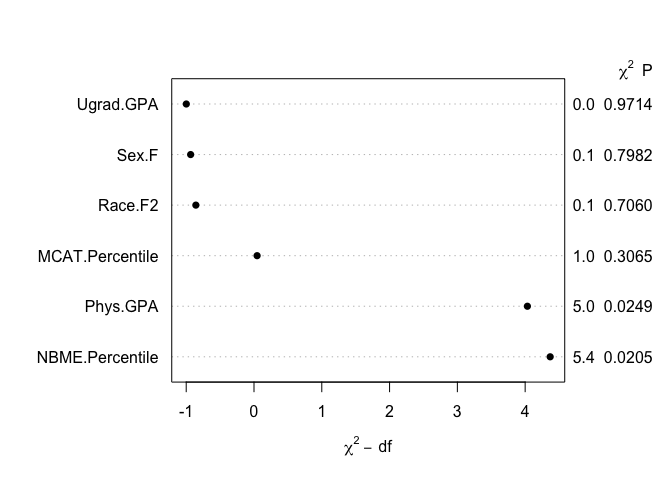

Again, `NBME.Percentile` and `Phys.GPA` are important here.

``` r
plot(summary(lrm.model.1))
```

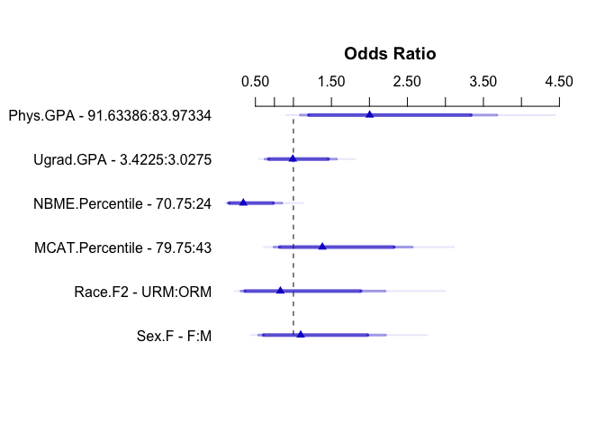

``` r
lrm.model.1.coef <- tidy(summary(lrm.model.1))

# Extract Even Rows and Confidence Intervals
lrm.model.1.tidy <- lrm.model.1.coef[c(FALSE, TRUE), 
                                     c("Effect", "Lower.0.95", "Upper.0.95")]

# set rownames
invisible((setattr(lrm.model.1.tidy, "row.names", 
                   c("Phys.GPA", "Ugrad.GPA", "NBME.Percentile", "MCAT.Percentile",
                     "Race.R2", "Sex.F - F:M"))))

pander(lrm.model.1.tidy, caption = "Odds Ratios: KS Complete Case")
```

<table style="width:79%;">
<caption>Odds Ratios: KS Complete Case</caption>
<colgroup>
<col width="30%" />
<col width="12%" />
<col width="18%" />
<col width="18%" />
</colgroup>
<thead>
<tr class="header">
<th align="center"> </th>
<th align="center">Effect</th>
<th align="center">Lower.0.95</th>
<th align="center">Upper.0.95</th>
</tr>
</thead>
<tbody>
<tr class="odd">
<td align="center"><strong>Phys.GPA</strong></td>
<td align="center">2.003</td>
<td align="center">1.092</td>
<td align="center">3.676</td>
</tr>
<tr class="even">
<td align="center"><strong>Ugrad.GPA</strong></td>
<td align="center">0.9917</td>
<td align="center">0.6279</td>
<td align="center">1.566</td>
</tr>
<tr class="odd">
<td align="center"><strong>NBME.Percentile</strong></td>
<td align="center">0.3409</td>
<td align="center">0.1372</td>
<td align="center">0.8471</td>
</tr>
<tr class="even">
<td align="center"><strong>MCAT.Percentile</strong></td>
<td align="center">1.381</td>
<td align="center">0.744</td>
<td align="center">2.562</td>
</tr>
<tr class="odd">
<td align="center"><strong>Race.R2</strong></td>
<td align="center">0.8282</td>
<td align="center">0.3111</td>
<td align="center">2.205</td>
</tr>
<tr class="even">
<td align="center"><strong>Sex.F - F:M</strong></td>
<td align="center">1.096</td>
<td align="center">0.5435</td>
<td align="center">2.21</td>
</tr>
</tbody>
</table>

Summary of the effects of each predictor, showing the effect on `Accepted` when moving from the 25th to the 75th percentile of each variable while holding the other variables at a prespecified level. As already seen in the ANOVA analysis,`Phys.GPA` and `NBME.Percentile` have the largest effect on `Accepted`. Increases in `Phys.GPA` doubles the likelihood of acceptance (OR: 2.003; 95% CI: 1.092, 3.676). Likewise, increases in `NBME.Percentile` decrease the likelihood of acceptance by about 66% (OR: 0.3409; 95% CI: 0.1372, 0.8471). `Ugrad.GPA`, `MCAT.Percentile`, `Race.R2`, and `Sex` all had effect sizes that crossed 1, reflecting what the ANOVA plot indicated in that `Phys.GPA` and `NBME.Percentile` are the most important terms in this model.

### Calibration

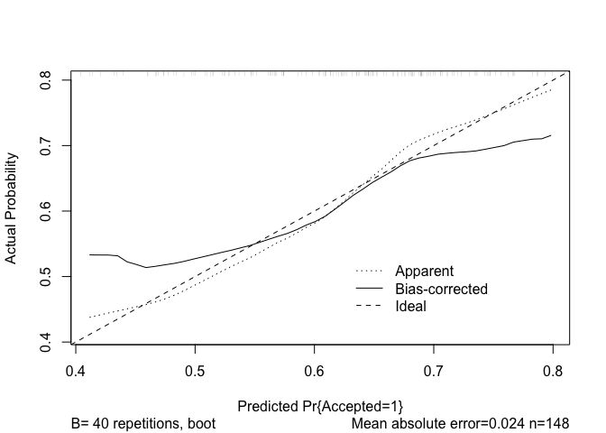


    n=148   Mean absolute error=0.024   Mean squared error=0.00118
    0.9 Quantile of absolute error=0.057

This calibration plot is quite terrible. This model underpredicts for probabilities under 0.6 and over predicts at probabilities above 0.7.

### Nomogram

``` r
plot(nomogram(lrm.model.1, fun=plogis, funlabel = "Probability of Acceptance"))
```

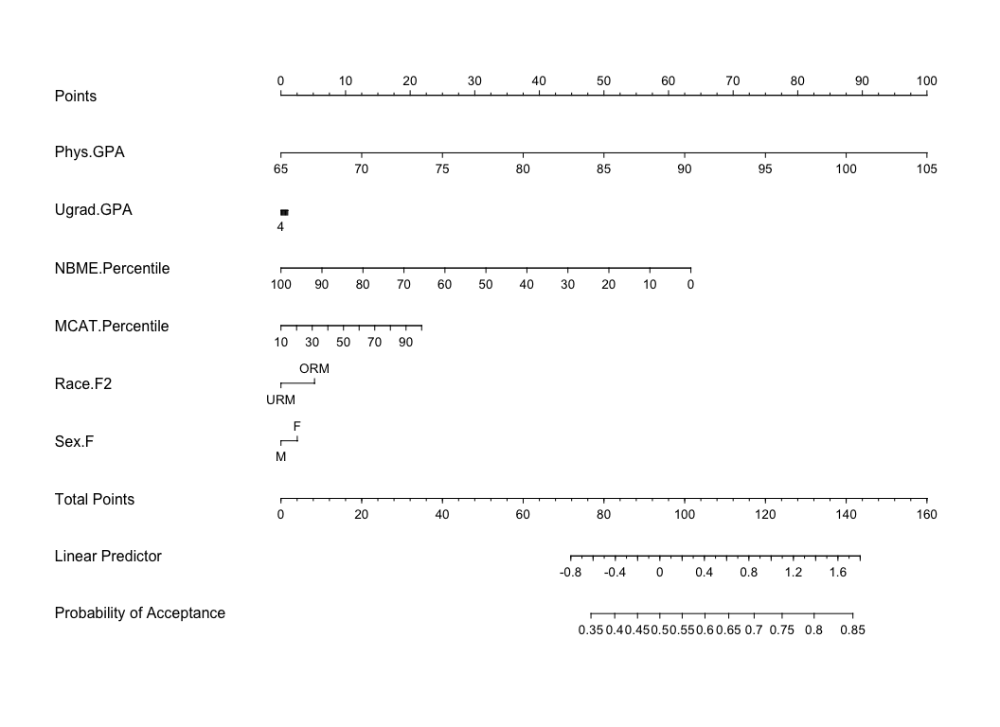

The nomogram highlights some important features. First, it is surprising how little of an impact undergraduate GPA has on the probability of acceptance; MCAT performance weighs more heavily, but is still not great at raising the probability of acceptance. Performance in the core physiology curriculum, however, does seem to have a large influence on the eventual probability. This was an expected finding, one which we thought we would see go hand-in-hand with undergraduate GPA and MCAT percentile. ‘Sex’ was right where we expected, having little overall effect, with females slightly favored. ‘Race’ was also a surprise: we expected race to have more weight in acceptance probability, much less the virtual 0 influence it has as predicted by this kitchen sink model.

Overall, we are surprised to see how much Medical Physiology performance influences probability of acceptance as compared to other factors, namely undergraduate GPA and MCAT percentile.

### Plot Predictions: Kitchen Sink

``` r
plot.ks.gpa <- ggplot(Predict(lrm.model.1, Phys.GPA = 60:105, Race.F2, Sex.F, fun=plogis)) +
  geom_point(aes(x = Phys.GPA, y = Accepted), data = Leo) +
    theme_bw() +
  labs(x = "Physiology Average",
         y = "Pr(Acceptance)",
         #title = "Model 1 - Kitchen Sink Predictions",
         subtitle = "Across Race and Sex, holding all other predictors at their medians")

plot.ks.nbme <- ggplot(Predict(lrm.model.1, NBME.Percentile = 0:100, Race.F2, Sex.F, fun=plogis)) +
  geom_point(aes(x = NBME.Percentile, y = Accepted), data = Leo) +
    theme_bw() +
  labs(x = "NBME Percentile",
         y = "Pr(Acceptance)",
         title = "Model 1 - Kitchen Sink Predictions",
         subtitle = "Across Race and Sex, holding all other predictors at their medians")

plot.ks.mcat <- ggplot(Predict(lrm.model.1, MCAT.Percentile = 0:100, Race.F2, Sex.F, fun=plogis)) +
  geom_point(aes(x = MCAT.Percentile, y = Accepted), data = Leo) +
    theme_bw() +
  labs(x = "MCAT Percentile",
         y = "Pr(Acceptance)",
         #title = "Model 1 - Kitchen Sink Predictions",
         subtitle = "Across Race and Sex, holding all other predictors at their medians")

grid.arrange(plot.ks.nbme, plot.ks.gpa, plot.ks.mcat, nrow = 3)
```

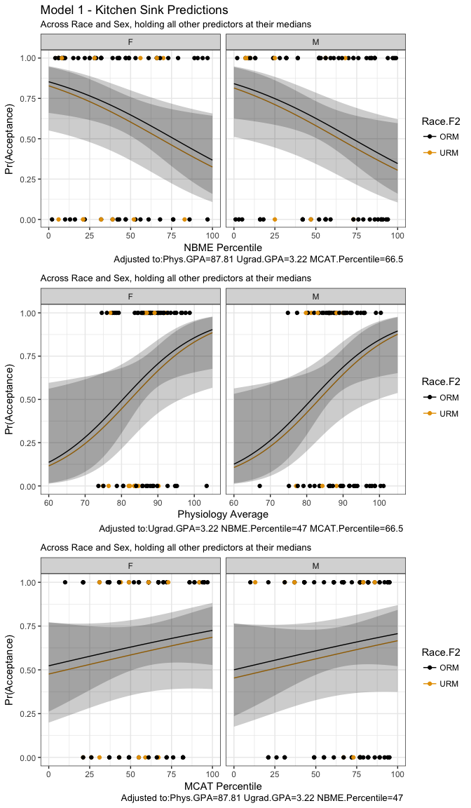

Holding Medical Physiology grade at a median value of 87.81, undergraduate GPA at 3.22, and MCAT percentile at 66.5, probability of acceptance declines with NBME performance. Again, this is unexpected. No significant differences between Sex or Race.

Holding undergraduate GPA at 3.22, NBME percentile at 47, and MCAT percentile at 66.5, probability of acceptance increases with Medical Physiology grade. Again, significant differences between Sex or Race.

Holding Medical Physiology grade at 87.81, undergraduate GPA at 3.22, and NBME Percentile at 47, probability of acceptance increased with MCAT percentile, although our model has suggested that MCAT percentile was not significant.

### Validate

``` r
set.seed(314); validate(lrm.model.1)
```

              index.orig training    test optimism index.corrected  n
    Dxy           0.2651   0.3476  0.1908   0.1568          0.1083 40
    R2            0.0648   0.1158  0.0358   0.0800         -0.0152 40
    Intercept     0.0000   0.0000  0.2260  -0.2260          0.2260 40
    Slope         1.0000   1.0000  0.5284   0.4716          0.5284 40
    Emax          0.0000   0.0000  0.1846   0.1846          0.1846 40
    D             0.0420   0.0822  0.0199   0.0623         -0.0202 40
    U            -0.0135  -0.0135  0.0226  -0.0361          0.0226 40
    Q             0.0555   0.0957 -0.0026   0.0983         -0.0428 40
    B             0.2238   0.2126  0.2353  -0.0227          0.2465 40
    g             0.5345   0.7332  0.3725   0.3607          0.1738 40
    gp            0.1212   0.1577  0.0859   0.0718          0.0493 40

A negative *R*<sup>2</sup> is a mathematical impossibility. The optimism here is quite high in both the Dxy and R2.

``` r
glm.model.1 <- glm(Accepted ~ Phys.GPA + Ugrad.GPA + NBME.Percentile +
         MCAT.Percentile + Race.F2 + Sex.F, data = Leo, 
         family="binomial"(link="logit"))
par(mfrow=c(1,2))
plot(glm.model.1, which  = c(4,5))
```

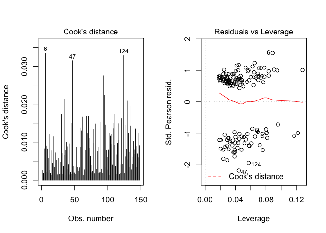

These plots did not help us identify any outliers. We only checked because some of the points in the prediction plots do not make sense. \#\# KS without NBME

Complete: NL
------------

``` r
plot(spearman2(Accepted ~ Phys.GPA + Ugrad.GPA + NBME.Percentile +
         MCAT.Percentile + Race.F2 + Sex.F, data = Leo))
```

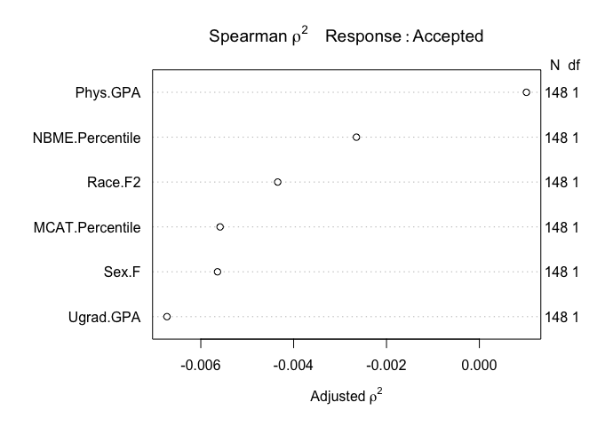

Here, we plot a Spearman rho2 plot to see if maybe there are some non-linear terms we can add. Fit a cubic spline to the `Phys.GPA`. Include interaction terms between `Race` and `NBME.Percentile`. Orginally we wanted to include interaction terms between `Race` and `Phys.GPA`, however the lrm() fit yielded singular values.

``` r
dd <- datadist(Leo)
options(datadist = "dd")

lrm.model.nl <- lrm(Accepted ~ rcs(Phys.GPA, 5) + Ugrad.GPA + NBME.Percentile*Race.F2 +
         MCAT.Percentile + Sex.F, data = Leo,
         x = TRUE, y = TRUE)
lrm.model.nl
```

    Logistic Regression Model
     
     lrm(formula = Accepted ~ rcs(Phys.GPA, 5) + Ugrad.GPA + NBME.Percentile * 
         Race.F2 + MCAT.Percentile + Sex.F, data = Leo, x = TRUE, 
         y = TRUE)
     
                          Model Likelihood     Discrimination    Rank Discrim.    
                             Ratio Test           Indexes           Indexes       
     Obs           148    LR chi2     16.47    R2       0.143    C       0.692    
      0             56    d.f.           10    g        0.836    Dxy     0.384    
      1             92    Pr(> chi2) 0.0870    gr       2.308    gamma   0.384    
     max |deriv| 8e-09                         gp       0.181    tau-a   0.182    
                                               Brier    0.210                     
     
                                   Coef     S.E.    Wald Z Pr(>|Z|)
     Intercept                     -10.0653 10.1622 -0.99  0.3220  
     Phys.GPA                        0.1219  0.1229  0.99  0.3214  
     Phys.GPA'                       0.2120  0.5476  0.39  0.6986  
     Phys.GPA''                     -1.5845  5.0256 -0.32  0.7525  
     Phys.GPA'''                     0.4855  9.8094  0.05  0.9605  
     Ugrad.GPA                       0.0590  0.6311  0.09  0.9255  
     NBME.Percentile                -0.0200  0.0111 -1.79  0.0727  
     Race.F2=URM                     0.3980  0.9414  0.42  0.6725  
     MCAT.Percentile                 0.0106  0.0090  1.17  0.2400  
     Sex.F=M                        -0.1050  0.3724 -0.28  0.7780  
     NBME.Percentile * Race.F2=URM  -0.0161  0.0202 -0.80  0.4253  
     

This non-linear model has a Nagelkerke R2 of 0.143, far from 1. The C statistic is 0.692, an improvement (compared to 0.633), but still suggests poor predictive ability by this measure. The *Brier score* is 0.210, where 0 is optimal. This model is a slight improvement with the risk of overfitting.

``` r
lrm.model.nl.coef <- tidy(summary(lrm.model.nl))

# Extract Even Rows and Confidence Intervals
lrm.model.nl.tidy <- lrm.model.nl.coef[c(FALSE, TRUE), 
                                     c("Effect", "Lower.0.95", "Upper.0.95")]

# set rownames
invisible((setattr(lrm.model.nl.tidy, "row.names", 
                   c("Phys.GPA", "Ugrad.GPA", "NBME.Percentile", "MCAT.Percentile",
                     "Race.F2 - URM:ORM", "Sex.F - F:M"))))

pander(lrm.model.nl.tidy, caption = "Odds Ratios: Non-linear Complete Case, NBME = 47, Race = ORM")
```

<table style="width:82%;">
<caption>Odds Ratios: Non-linear Complete Case, NBME = 47, Race = ORM</caption>
<colgroup>
<col width="33%" />
<col width="12%" />
<col width="18%" />
<col width="18%" />
</colgroup>
<thead>
<tr class="header">
<th align="center"> </th>
<th align="center">Effect</th>
<th align="center">Lower.0.95</th>
<th align="center">Upper.0.95</th>
</tr>
</thead>
<tbody>
<tr class="odd">
<td align="center"><strong>Phys.GPA</strong></td>
<td align="center">3.325</td>
<td align="center">1.002</td>
<td align="center">11.03</td>
</tr>
<tr class="even">
<td align="center"><strong>Ugrad.GPA</strong></td>
<td align="center">1.024</td>
<td align="center">0.628</td>
<td align="center">1.668</td>
</tr>
<tr class="odd">
<td align="center"><strong>NBME.Percentile</strong></td>
<td align="center">0.3927</td>
<td align="center">0.1415</td>
<td align="center">1.09</td>
</tr>
<tr class="even">
<td align="center"><strong>MCAT.Percentile</strong></td>
<td align="center">1.477</td>
<td align="center">0.7707</td>
<td align="center">2.829</td>
</tr>
<tr class="odd">
<td align="center"><strong>Race.F2 - URM:ORM</strong></td>
<td align="center">0.6995</td>
<td align="center">0.2426</td>
<td align="center">2.017</td>
</tr>
<tr class="even">
<td align="center"><strong>Sex.F - F:M</strong></td>
<td align="center">1.111</td>
<td align="center">0.5353</td>
<td align="center">2.304</td>
</tr>
</tbody>
</table>

Summary of the effects of each predictor, showing the effect on ‘Accepted’ when moving from the 25th to the 75th percentile of each variable while holding the other variables at a prespecified level. Increases in ‘Phys.GPA’ increases the likelihood of acceptance (OR: 3.325; 95% CI: 1.002, 11.03). ‘Ugrad.GPA’, ‘MCAT.Percentile’, ‘Race.R2’, and ‘Sex’ all had effect sizes that crossed 1.

### Calibration

``` r
plot(calibrate(lrm.model.nl))
```

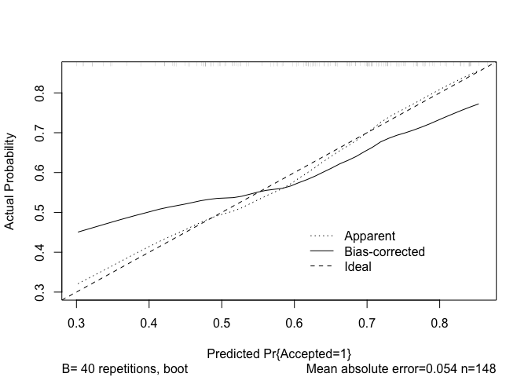


    n=148   Mean absolute error=0.054   Mean squared error=0.00371
    0.9 Quantile of absolute error=0.082

The calibration plot for this non-linear model also under-predicts for probabilities under 0.6 and over-predicts at probabilities above 0.6. It, however, yields a mean absolute error of 0.054 (vs. 0.033 in the Kitchen Sink model) and a mean squared error of 0.00371 (vs. 0.00177 in the Kitchen Sink model).

### ROC

### Nomogram

``` r
plot(nomogram(lrm.model.nl, fun=plogis, funlabel = "Probability of Acceptance"))
```

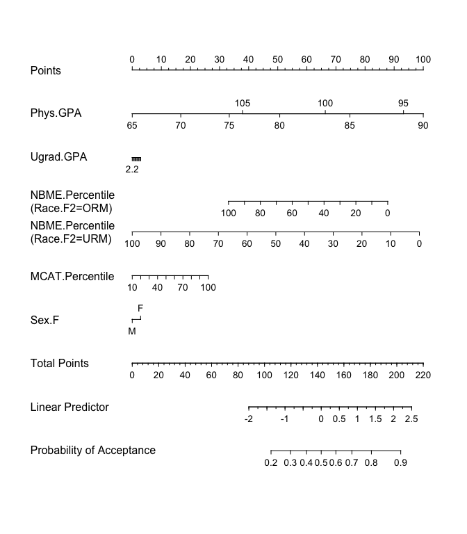

While the model was slightly improved by adding a non-linear term and an interaction term, the nomogram tells an interesting story. Undergraduate GPA, MCAT percentile, and Sex remain in similar positions as in the Kitchen Sink model. Better performance in the core physiology courses increases probability of acceptance, to an extent; &gt;90% performance becomes deleterious. `NBME.Percentile` has a much larger effect for underrepresented minorities, with the odd effect that a better NBME percentile worsens the probability of acceptance. This is the opposite effect we expected.

### Plot Predictions

``` r
plot.nl.nbme <- ggplot(Predict(lrm.model.nl, NBME.Percentile = 0:100, Race.F2, Sex.F, fun=plogis)) +
  geom_point(aes(x = NBME.Percentile, y = Accepted), data = Leo) +
    theme_bw() +
  labs(x = "NBME Percentile",
         y = "Pr(Acceptance)",
         title = "Model 2 - Nonlinear Predictions",
         subtitle = "Across Race and Sex, holding all other predictors at their medians")

plot.nl.gpa <- ggplot(Predict(lrm.model.nl, Phys.GPA = 60:105, Race.F2, Sex.F, fun=plogis)) +
  geom_point(aes(x = Phys.GPA, y = Accepted), data = Leo) +
    theme_bw() +
  labs(x = "Weighted Physiology Average",
         y = "Pr(Acceptance)",
         title = "Model 2 - Nonlinear Predictions",
         subtitle = "Across Race and Sex, holding all other predictors at their medians")

plot.nl.mcat <- ggplot(Predict(lrm.model.nl, MCAT.Percentile = 0:100, Race.F2, Sex.F, fun=plogis)) +
  geom_point(aes(x = MCAT.Percentile, y = Accepted), data = Leo) +
    theme_bw() +
  labs(x = "MCAT Percentile",
         y = "Pr(Acceptance)",
         #title = "Model 1 - Kitchen Sink Predictions",
         subtitle = "Across Race and Sex, holding all other predictors at their medians")

grid.arrange(plot.nl.nbme, plot.nl.gpa, plot.nl.mcat, nrow = 3)
```

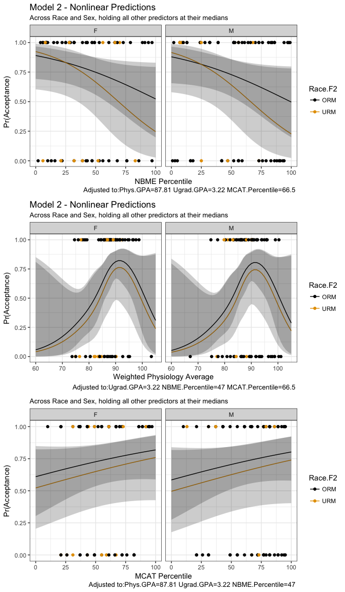

Holding Medical Physiology grades at 87.81, undergraduate GPA at 3.22, and MCAT percentile at 66.5, probability of acceptance again declines with NBME performance. Probability of acceptance declines more precipitously within the underrepresented minorities group. This could be because the lack of data we have for underrepresented students.

Holding undergraduate GPA at 3.22, NBME percentile at 47, and MCAT percentile at 66.5, the probability of acceptance increases with Medical Physiology grade, again, to an extent. This may have to do with some limitations of our data set, which we will address later.

``` r
glm.model.nl <- glm(Accepted ~ rcs(Phys.GPA, 5) + Ugrad.GPA + NBME.Percentile*Race.F2 +
         MCAT.Percentile + Sex.F, data = Leo, 
         family="binomial"(link="logit"))
par(mfrow=c(1,2))
plot(glm.model.nl, which  = c(4,5))
```

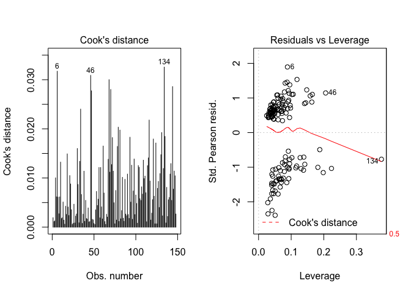

These plots did not help us identify any outliers. We only checked because some of the points in the prediction plots do not make sense.

### Validate

``` r
set.seed(314); validate(lrm.model.nl)
```

              index.orig training   test optimism index.corrected  n
    Dxy           0.3839   0.4661 0.2908   0.1753          0.2086 40
    R2            0.1433   0.2152 0.0843   0.1309          0.0125 40
    Intercept     0.0000   0.0000 0.2041  -0.2041          0.2041 40
    Slope         1.0000   1.0000 0.5607   0.4393          0.5607 40
    Emax          0.0000   0.0000 0.1671   0.1671          0.1671 40
    D             0.1045   0.1657 0.0575   0.1082         -0.0037 40
    U            -0.0135  -0.0135 0.0441  -0.0576          0.0441 40
    Q             0.1180   0.1792 0.0134   0.1658         -0.0478 40
    B             0.2100   0.1952 0.2286  -0.0334          0.2434 40
    g             0.8363   1.0893 0.5972   0.4921          0.3442 40
    gp            0.1810   0.2174 0.1336   0.0838          0.0972 40

Imputation
----------

``` r
# Check patterns in missingness 
marginplot(Trish[, c("MCAT.Percentile", "Ugrad.GPA")])
```


We are missing 30 counts of Undergraduate GPA and 85 counts of MCAT Percentiles. There are 19 students with both missing. Undergrad GPA is probably missing at random. MCAT Percentile is probably not.

``` r
aggr(Trish, 
     numbers = TRUE, sortVARS = TRUE,
     labels = names(Trish), cex.axis = 0.5,
     gap = 3, ylab = c("Missing Data", "Pattern"))
```


``` r
# MCAT Percentile is missing > 30% of data
# Ugrad gpa/Sex is only missing in arond 10%
# Missing grades for the 2016 cohort
# Missing Acceptances for 2016 cohort
```

`Ugrad.GPA`, `MCAT.Percentile`, `Race.F`, `Sex.F` are all missing at least 10% of the data. `MCAT.Percentile` is missing about 30%.

``` r
# Non Missing Outcomes
# Initialize Imputation Stuff
imp.t <- mice(Trish, max=0, print=FALSE)

# Predictor Matrix
pred <- imp.t$predictorMatrix

# record ID & Program Choice aren't used as predictors
pred[, c("record.ID", "Sex")] <- 0 

# Run with 50 frames and 10 iterations
imp.t <- mice(Trish, pred = pred,
            m = 4, maxit = 10, seed = 271828, print = F)

# Combine all of the imputation frames in a long dataset
imp.t.complete <- mice::complete(imp.t, 'long')
imp.single.3 <- as.data.frame(mice::complete(imp.t, 3)) # save frame 3 as a dataframe
```

``` r
# Non missing Outcomes
# Density plots for Imputed Values
densityplot(imp.t)
```


The density histograms were plotted for each imputed frame (pink) against the observed values (blue). While the ugrad GPA has a similar distribtuion to the observed values, the MCAT percentiles were more symmetric than was observed in the exisiting data. The imputed frames give more weight to the lower end of the percentile range. This is annoying.

### Pooled Analyses

``` r
# Non Linear
dd <- datadist(imp.single.3)
options(datadist = "dd")

lrm.model.nl.imp <- with(imp.t, lrm(Accepted ~ rcs(Phys.GPA, 5) + Ugrad.GPA + NBME.Percentile*Race.F2 +
         MCAT.Percentile + Sex.F, data = Leo,
         x = TRUE, y = TRUE))
nl.imp.t.pool <- pool(lrm.model.nl.imp)
nl.imp.t.results <- summary(pool(lrm.model.nl.imp))
pander(round(nl.imp.t.results, 2), caption = "Non-Exponentiated Imputed Pooled Results")
```

<table>
<caption>Non-Exponentiated Imputed Pooled Results (continued below)</caption>
<colgroup>
<col width="29%" />
<col width="9%" />
<col width="8%" />
<col width="8%" />
<col width="9%" />
<col width="14%" />
<col width="10%" />
<col width="10%" />
</colgroup>
<thead>
<tr class="header">
<th align="center"> </th>
<th align="center">est</th>
<th align="center">se</th>
<th align="center">t</th>
<th align="center">df</th>
<th align="center">Pr(&gt;|t|)</th>
<th align="center">lo 95</th>
<th align="center">hi 95</th>
</tr>
</thead>
<tbody>
<tr class="odd">
<td align="center"><strong>Intercept</strong></td>
<td align="center">-10.07</td>
<td align="center">10.16</td>
<td align="center">-0.99</td>
<td align="center">996575</td>
<td align="center">0.32</td>
<td align="center">-29.98</td>
<td align="center">9.85</td>
</tr>
<tr class="even">
<td align="center"><strong>Phys.GPA</strong></td>
<td align="center">0.12</td>
<td align="center">0.12</td>
<td align="center">0.99</td>
<td align="center">996575</td>
<td align="center">0.32</td>
<td align="center">-0.12</td>
<td align="center">0.36</td>
</tr>
<tr class="odd">
<td align="center"><strong>Phys.GPA'</strong></td>
<td align="center">0.21</td>
<td align="center">0.55</td>
<td align="center">0.39</td>
<td align="center">996575</td>
<td align="center">0.7</td>
<td align="center">-0.86</td>
<td align="center">1.29</td>
</tr>
<tr class="even">
<td align="center"><strong>Phys.GPA''</strong></td>
<td align="center">-1.58</td>
<td align="center">5.03</td>
<td align="center">-0.32</td>
<td align="center">996575</td>
<td align="center">0.75</td>
<td align="center">-11.43</td>
<td align="center">8.27</td>
</tr>
<tr class="odd">
<td align="center"><strong>Phys.GPA'''</strong></td>
<td align="center">0.49</td>
<td align="center">9.81</td>
<td align="center">0.05</td>
<td align="center">996575</td>
<td align="center">0.96</td>
<td align="center">-18.74</td>
<td align="center">19.71</td>
</tr>
<tr class="even">
<td align="center"><strong>Ugrad.GPA</strong></td>
<td align="center">0.06</td>
<td align="center">0.63</td>
<td align="center">0.09</td>
<td align="center">996575</td>
<td align="center">0.93</td>
<td align="center">-1.18</td>
<td align="center">1.3</td>
</tr>
<tr class="odd">
<td align="center"><strong>NBME.Percentile</strong></td>
<td align="center">-0.02</td>
<td align="center">0.01</td>
<td align="center">-1.79</td>
<td align="center">996575</td>
<td align="center">0.07</td>
<td align="center">-0.04</td>
<td align="center">0</td>
</tr>
<tr class="even">
<td align="center"><strong>Race.F2=URM</strong></td>
<td align="center">0.4</td>
<td align="center">0.94</td>
<td align="center">0.42</td>
<td align="center">996575</td>
<td align="center">0.67</td>
<td align="center">-1.45</td>
<td align="center">2.24</td>
</tr>
<tr class="odd">
<td align="center"><strong>MCAT.Percentile</strong></td>
<td align="center">0.01</td>
<td align="center">0.01</td>
<td align="center">1.17</td>
<td align="center">996575</td>
<td align="center">0.24</td>
<td align="center">-0.01</td>
<td align="center">0.03</td>
</tr>
<tr class="even">
<td align="center"><strong>Sex.F=M</strong></td>
<td align="center">-0.1</td>
<td align="center">0.37</td>
<td align="center">-0.28</td>
<td align="center">996575</td>
<td align="center">0.78</td>
<td align="center">-0.83</td>
<td align="center">0.62</td>
</tr>
<tr class="odd">
<td align="center">**NBME.Percentile * Race.F2=URM**</td>
<td align="center">-0.02</td>
<td align="center">0.02</td>
<td align="center">-0.8</td>
<td align="center">996575</td>
<td align="center">0.43</td>
<td align="center">-0.06</td>
<td align="center">0.02</td>
</tr>
</tbody>
</table>

<table style="width:60%;">
<colgroup>
<col width="30%" />
<col width="9%" />
<col width="8%" />
<col width="11%" />
</colgroup>
<thead>
<tr class="header">
<th align="center"> </th>
<th align="center">nmis</th>
<th align="center">fmi</th>
<th align="center">lambda</th>
</tr>
</thead>
<tbody>
<tr class="odd">
<td align="center"><strong>Intercept</strong></td>
<td align="center">NA</td>
<td align="center">0</td>
<td align="center">0</td>
</tr>
<tr class="even">
<td align="center"><strong>Phys.GPA</strong></td>
<td align="center">0</td>
<td align="center">0</td>
<td align="center">0</td>
</tr>
<tr class="odd">
<td align="center"><strong>Phys.GPA'</strong></td>
<td align="center">NA</td>
<td align="center">0</td>
<td align="center">0</td>
</tr>
<tr class="even">
<td align="center"><strong>Phys.GPA''</strong></td>
<td align="center">NA</td>
<td align="center">0</td>
<td align="center">0</td>
</tr>
<tr class="odd">
<td align="center"><strong>Phys.GPA'''</strong></td>
<td align="center">NA</td>
<td align="center">0</td>
<td align="center">0</td>
</tr>
<tr class="even">
<td align="center"><strong>Ugrad.GPA</strong></td>
<td align="center">30</td>
<td align="center">0</td>
<td align="center">0</td>
</tr>
<tr class="odd">
<td align="center"><strong>NBME.Percentile</strong></td>
<td align="center">0</td>
<td align="center">0</td>
<td align="center">0</td>
</tr>
<tr class="even">
<td align="center"><strong>Race.F2=URM</strong></td>
<td align="center">NA</td>
<td align="center">0</td>
<td align="center">0</td>
</tr>
<tr class="odd">
<td align="center"><strong>MCAT.Percentile</strong></td>
<td align="center">85</td>
<td align="center">0</td>
<td align="center">0</td>
</tr>
<tr class="even">
<td align="center"><strong>Sex.F=M</strong></td>
<td align="center">NA</td>
<td align="center">0</td>
<td align="center">0</td>
</tr>
<tr class="odd">
<td align="center">**NBME.Percentile * Race.F2=URM**</td>
<td align="center">NA</td>
<td align="center">0</td>
<td align="center">0</td>
</tr>
</tbody>
</table>

``` r
# Exponentiate the Pooled results to get odds ratios
pander(round(exp(nl.imp.t.results[, c("est", "lo 95", "hi 95")]), 2), 
       caption = "Odds Ratios: Non-Linear, Multiply Imputed Predictors")
```

<table style="width:62%;">
<caption>Odds Ratios: Non-Linear, Multiply Imputed Predictors</caption>
<colgroup>
<col width="30%" />
<col width="8%" />
<col width="11%" />
<col width="12%" />
</colgroup>
<thead>
<tr class="header">
<th align="center"> </th>
<th align="center">est</th>
<th align="center">lo 95</th>
<th align="center">hi 95</th>
</tr>
</thead>
<tbody>
<tr class="odd">
<td align="center"><strong>Intercept</strong></td>
<td align="center">0</td>
<td align="center">0</td>
<td align="center">19003</td>
</tr>
<tr class="even">
<td align="center"><strong>Phys.GPA</strong></td>
<td align="center">1.13</td>
<td align="center">0.89</td>
<td align="center">1.44</td>
</tr>
<tr class="odd">
<td align="center"><strong>Phys.GPA'</strong></td>
<td align="center">1.24</td>
<td align="center">0.42</td>
<td align="center">3.62</td>
</tr>
<tr class="even">
<td align="center"><strong>Phys.GPA''</strong></td>
<td align="center">0.21</td>
<td align="center">0</td>
<td align="center">3887</td>
</tr>
<tr class="odd">
<td align="center"><strong>Phys.GPA'''</strong></td>
<td align="center">1.62</td>
<td align="center">0</td>
<td align="center">363584801</td>
</tr>
<tr class="even">
<td align="center"><strong>Ugrad.GPA</strong></td>
<td align="center">1.06</td>
<td align="center">0.31</td>
<td align="center">3.65</td>
</tr>
<tr class="odd">
<td align="center"><strong>NBME.Percentile</strong></td>
<td align="center">0.98</td>
<td align="center">0.96</td>
<td align="center">1</td>
</tr>
<tr class="even">
<td align="center"><strong>Race.F2=URM</strong></td>
<td align="center">1.49</td>
<td align="center">0.24</td>
<td align="center">9.42</td>
</tr>
<tr class="odd">
<td align="center"><strong>MCAT.Percentile</strong></td>
<td align="center">1.01</td>
<td align="center">0.99</td>
<td align="center">1.03</td>
</tr>
<tr class="even">
<td align="center"><strong>Sex.F=M</strong></td>
<td align="center">0.9</td>
<td align="center">0.43</td>
<td align="center">1.87</td>
</tr>
<tr class="odd">
<td align="center">**NBME.Percentile * Race.F2=URM**</td>
<td align="center">0.98</td>
<td align="center">0.95</td>
<td align="center">1.02</td>
</tr>
</tbody>
</table>

Nothing is significant here. Note the extremely high Upper 95% CI. The pooling did not work well here.

``` r
par(mfrow = c(2,2))
invisible(with(imp.t, plot(calibrate(lrm.model.nl, fun=plogis, funlabel = "Probability of Acceptance"))))
```


    n=148   Mean absolute error=0.047   Mean squared error=0.00321
    0.9 Quantile of absolute error=0.085


    n=148   Mean absolute error=0.051   Mean squared error=0.00348
    0.9 Quantile of absolute error=0.085


    n=148   Mean absolute error=0.046   Mean squared error=0.00305
    0.9 Quantile of absolute error=0.08

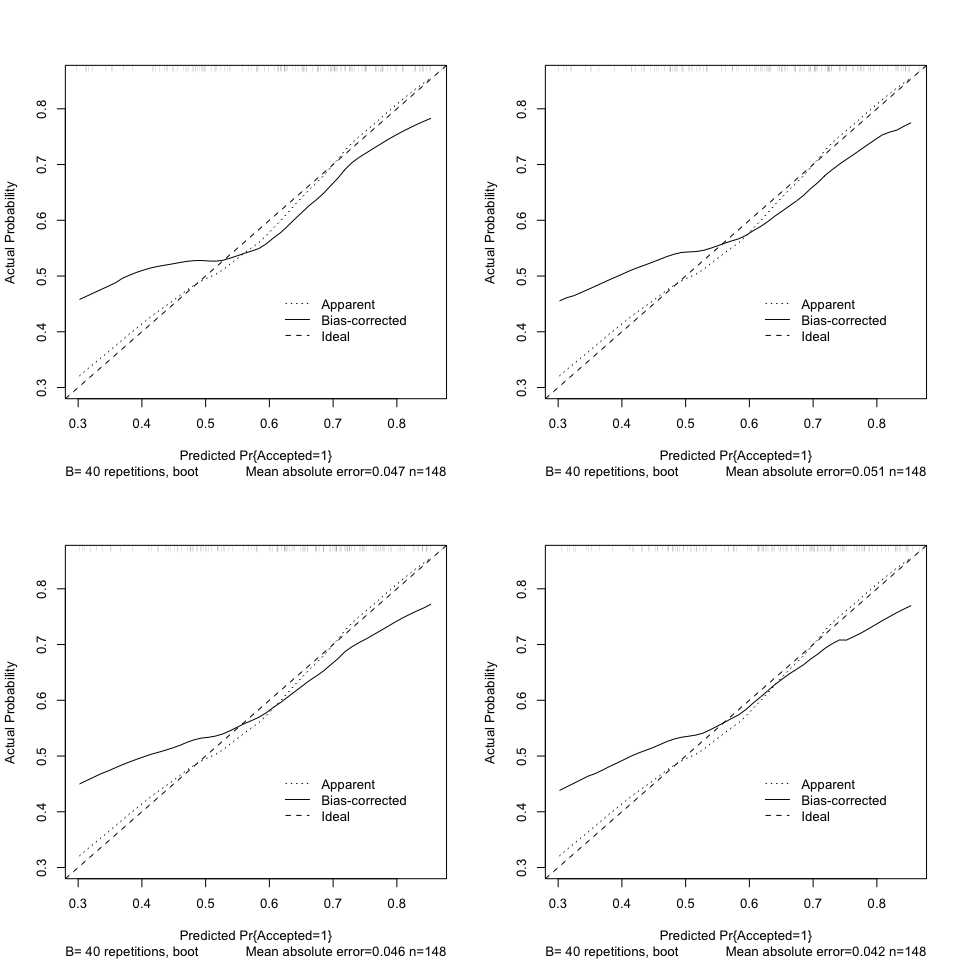


    n=148   Mean absolute error=0.042   Mean squared error=0.00278
    0.9 Quantile of absolute error=0.081

``` r
par(mfrow = c(1,1))
```

Calibration plots look really similar to the non-linear complete case.

Validate Using an Imputed Frame
-------------------------------

``` r
# Kitchen sink using new data
e <- datadist(imp.single.3)
options(datadist = "e")

#ks.imp.3 <- lrm(Accepted ~ Phys.GPA + Ugrad.GPA + NBME.Percentile +
         #MCAT.Percentile + Race.2 + Sex, data = imp.single.3,
         #x = TRUE, y = TRUE)
pred.ks.imp.3 <- predict(lrm.model.1, newdata = data.frame(imp.single.3), type = "fitted")
pred.nl.imp.3 <- predict(lrm.model.nl, newdata = data.frame(imp.single.3), type = "fitted")
```

``` r
# Compare Models 1 and 2 based on Prediction Error Summaries
errors_ks <- imp.single.3$Accepted - pred.ks.imp.3
errors_nl <- imp.single.3$Accepted - pred.nl.imp.3

mape_ks <- mean(abs(errors_ks))
mape_nl <- mean(abs(errors_nl))

mspe_ks <- mean(errors_ks^2)
mspe_nl <- mean(errors_nl^2)

cor_ks <- cor(imp.single.3$Accepted, pred.ks.imp.3)
cor_nl <- cor(imp.single.3$Accepted, pred.nl.imp.3)

Cstat_ks <- rcorr.cens(pred.ks.imp.3, imp.single.3$Accepted)[1]
Cstat_nl <- rcorr.cens(pred.nl.imp.3, imp.single.3$Accepted)[1]

validation.table <- data_frame(
  Model = c("KS Complete", "NL Complete"),
  MAPE = round(c(mape_ks, mape_nl),3),
  MSPE = round(c(mspe_ks, mspe_nl),3),
  'Corr with Admit' = round(c(cor_ks, cor_nl),3),
  'Est. C' = round(c(Cstat_ks, Cstat_nl),3))

#pander(validation.table, 
       #caption = "Validating on an Imputed Frame")
validation.table
```

    # A tibble: 2 x 5
            Model  MAPE  MSPE `Corr with Admit` `Est. C`
            <chr> <dbl> <dbl>             <dbl>    <dbl>
    1 KS Complete 0.460 0.232             0.225    0.640
    2 NL Complete 0.432 0.216             0.341    0.701

Comparison: Complete Cases
==========================

    # A tibble: 2 x 7
            Model   Dxy     C    R2 Brier   AIC   BIC
            <chr> <dbl> <dbl> <dbl> <dbl> <dbl> <dbl>
    1 KS Complete 0.266 0.633 0.065 0.224   203   224
    2 NL Complete 0.384 0.692 0.143 0.210   202   235

The R2 for both the Kitchen Sink and Nonlinear models are pretty poor, although the nonlinear model’s R2 is slightly better. The AIC may as well be identical for the two models, while the Kitchen Sink has a better BIC. Using the table alone, the nonlinear is a more attractive option. However, we do have some concerns with the nonlinear model, referenced above, that steers us towards the kitchen sink model instead.

Conclusions
===========

-   While higher MCAT Percentiles were associated with increased probabilities of acceptance, the effect size was not as large as we expected. In our dataset, MCAT was not significant. This is likely reflective of the fact that we only had one MCAT score per student; it is likely that students scoring below the 70th percentile retook the exam before ultimately gaining acceptance to medical school.s

-   The average scores in the core physiology courses were predictive of acceptance. Via the kitchen sink model, students with better performance were more likely to gain acceptance. The non-linear model also predicted this up to around an average of 90%, where the likelihood of acceptance plummets.

Given the findings of our models, there are some real issues with this dataset:

-   For students not gaining admission to school, there was no indication as to whether or not they applied.
-   Only the first MCAT score that the student applied with to the graduate program was available. We have no way of knowing if he/she retook the exam unless they answered the exit survey.
-   Interview performance is also a very important factor in admissions, and this was completely left out of this analysis.

1.  We learned:

-   Minimize free form boxes on surveys. People think differently and like to provide a mixture of text and numbers. People also spell their names differently from time to time.
-   We really like the `full_join` function. Also this `%>%` is very convenient for tidying tibbles.
-   Model validation with multiple imputations is non-trivial.

Opportunities for Further Investigation:

-   Get a better dataset

``` r
# Obtain R version/Platform/OS
sessionInfo()
```

    R version 3.4.0 (2017-04-21)
    Platform: x86_64-apple-darwin15.6.0 (64-bit)
    Running under: macOS Sierra 10.12.4

    Matrix products: default
    BLAS: /Library/Frameworks/R.framework/Versions/3.4/Resources/lib/libRblas.0.dylib
    LAPACK: /Library/Frameworks/R.framework/Versions/3.4/Resources/lib/libRlapack.dylib

    locale:
    [1] en_US.UTF-8/en_US.UTF-8/en_US.UTF-8/C/en_US.UTF-8/en_US.UTF-8

    attached base packages:
    [1] grid      stats     graphics  grDevices utils     datasets  methods  
    [8] base     

    other attached packages:
     [1] bindrcpp_0.1       dplyr_0.7.0        purrr_0.2.2.2     
     [4] readr_1.1.1        tidyr_0.6.3        tibble_1.3.3      
     [7] tidyverse_1.1.1    searchable_0.3.3.1 broom_0.4.2       
    [10] VIM_4.7.0          data.table_1.10.4  colorspace_1.3-2  
    [13] mitools_2.3        forcats_0.2.0      rms_5.1-1         
    [16] SparseM_1.77       Hmisc_4.0-3        ggplot2_2.2.1     
    [19] Formula_1.2-1      survival_2.41-3    lattice_0.20-35   
    [22] miceadds_2.4-12    mice_2.30          readxl_1.0.0      
    [25] ROCR_1.0-7         gplots_3.0.1       pander_0.6.0      
    [28] gridExtra_2.2.1    tableone_0.7.3     leaps_3.0         
    [31] arm_1.9-3          lme4_1.1-13        Matrix_1.2-10     
    [34] MASS_7.3-47        rmdformats_0.3.3   knitr_1.16        

    loaded via a namespace (and not attached):
      [1] backports_1.1.0       blme_1.0-4            sm_2.2-5.4           
      [4] plyr_1.8.4            igraph_1.0.1          grouped_0.6-0        
      [7] GPArotation_2014.11-1 lazyeval_0.2.0        sp_1.2-4             
     [10] splines_3.4.0         polycor_0.7-9         TH.data_1.0-8        
     [13] digest_0.6.12         htmltools_0.3.6       gdata_2.18.0         
     [16] magrittr_1.5          checkmate_1.8.2       sirt_2.0-25          
     [19] cluster_2.0.6         sfsmisc_1.1-1         modelr_0.1.0         
     [22] sandwich_2.3-4        lpSolve_5.6.13        rvest_0.3.2          
     [25] haven_1.0.0           jsonlite_1.5          bindr_0.1            
     [28] zoo_1.8-0             ape_4.1               glue_1.1.0           
     [31] multiwayvcov_1.2.3    gtable_0.2.0          MatrixModels_0.4-1   
     [34] sjmisc_2.5.0          questionr_0.6.0       mirt_1.24            
     [37] car_2.1-4             kernlab_0.9-25        DEoptimR_1.0-8       
     [40] abind_1.4-5           scales_0.4.1          mvtnorm_1.0-6        
     [43] miniUI_0.1.1          Rcpp_0.12.11          laeken_0.4.6         
     [46] xtable_1.8-2          htmlTable_1.9         foreign_0.8-68       
     [49] stats4_3.4.0          survey_3.32           vcd_1.4-3            
     [52] httr_1.2.1            htmlwidgets_0.8       RColorBrewer_1.1-2   
     [55] lavaan_0.5-23.1097    acepack_1.4.1         pkgconfig_2.0.1      
     [58] nnet_7.3-12           labeling_0.3          rlang_0.1.1          
     [61] reshape2_1.4.2        munsell_0.4.3         cellranger_1.1.0     
     [64] tools_3.4.0           sjlabelled_1.0.0      evaluate_0.10        
     [67] stringr_1.2.0         yaml_2.1.14           robustbase_0.92-7    
     [70] ic.infer_1.1-5        caTools_1.17.1        nlme_3.1-131         
     [73] mime_0.5              quantreg_5.33         lavaan.survey_1.1.3.1
     [76] xml2_1.1.1            compiler_3.4.0        pbkrtest_0.4-7       
     [79] rstudioapi_0.6        e1071_1.6-8           kappalab_0.4-7       
     [82] pbivnorm_0.6.0        stringi_1.1.5         highr_0.6            
     [85] cubature_1.3-8        TAM_2.1-43            psych_1.7.5          
     [88] nloptr_1.0.4          tensorA_0.36          stringdist_0.9.4.4   
     [91] CDM_5.5-21            lmtest_0.9-35         combinat_0.0-8       
     [94] bitops_1.0-6          corpcor_1.6.9         httpuv_1.3.3         
     [97] MCMCglmm_2.24         R6_2.2.1              latticeExtra_0.6-28  
    [100] bookdown_0.4          KernSmooth_2.23-15    codetools_0.2-15     
    [103] polspline_1.1.12      boot_1.3-19           gtools_3.5.0         
    [106] assertthat_0.2.0      rprojroot_1.2         mnormt_1.5-5         
    [109] multcomp_1.4-6        hms_0.3               WrightMap_1.2.1      
    [112] mgcv_1.8-17           parallel_3.4.0        quadprog_1.5-5       
    [115] rpart_4.1-11          class_7.3-14          coda_0.19-1          
    [118] minqa_1.2.4           rmarkdown_1.6         lubridate_1.6.0      
    [121] shiny_1.0.3           base64enc_0.1-3
